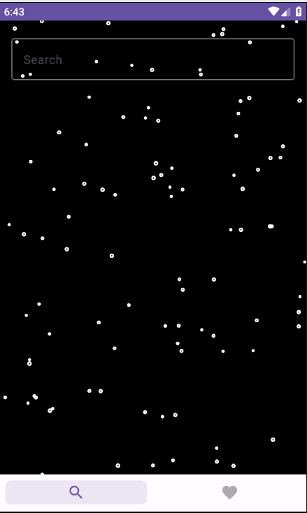
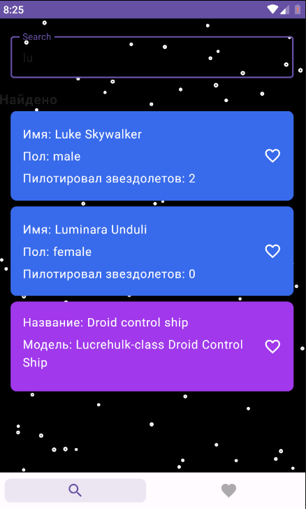
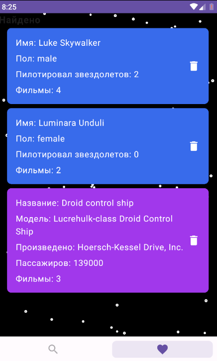
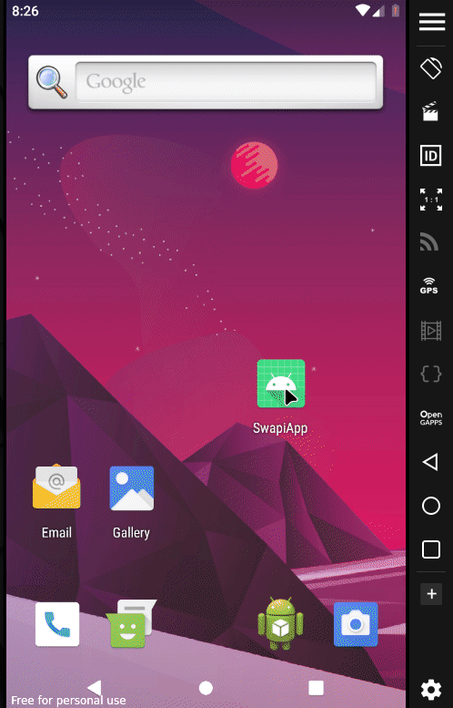

# SwapiApp

## Что это за приложение?

Приложение выполнено в рамках тестового задания компании "Montekrist media"

## UI скриншот

|                  | Portrait                                    | 
|------------------|---------------------------------------------|
| search screen    |  |                                                                       |
|                  |  |                                                                       |
| favorites screen |  |                                                                       |
| gif              |  |                                                                       |

## использованные технологии

1. Jetpack Compose
2. Navigation
3. API Calls using Retrofit
4. Clean Architecture
5. DI Koin
6. Room 

## Использованно Api

**https://swapi.dev/**

## Сборка и запуск

Сборка и запуск средствами Android Studio

